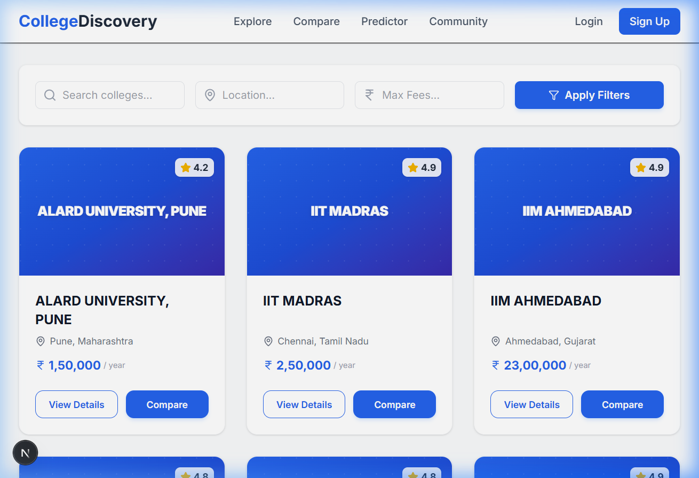
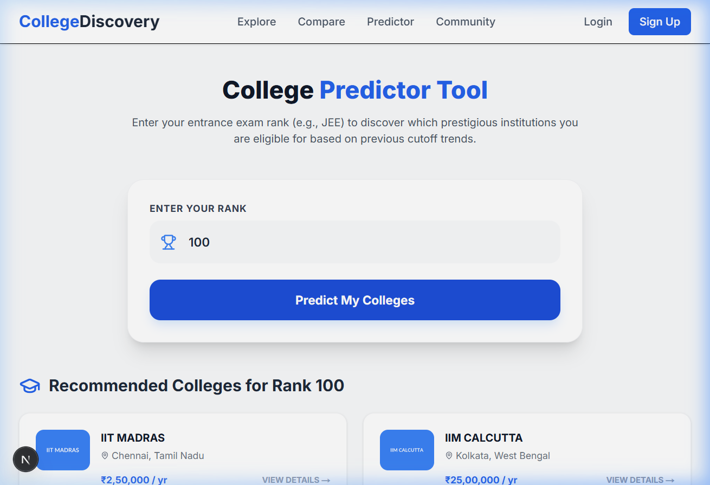
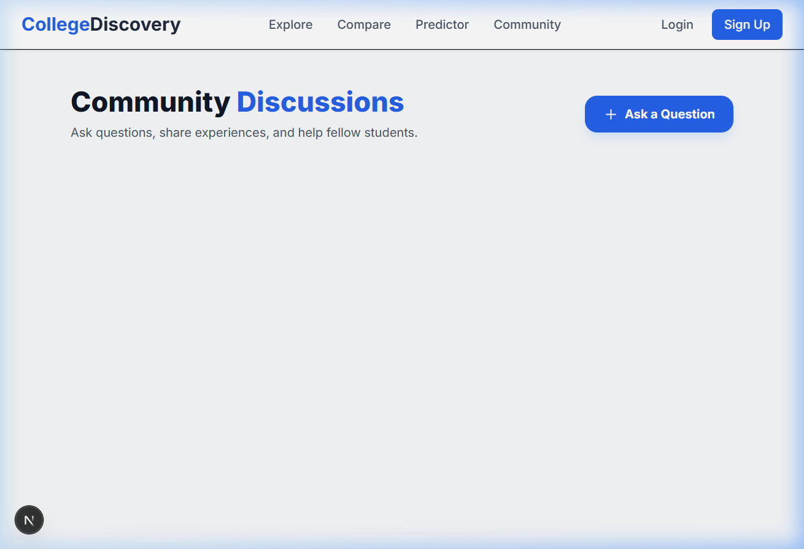

# 🎓 College Discovery Platform

[](https://nextjs.org/)
[](https://tailwindcss.com/)
[](https://nodejs.org/)
[](https://neon.tech/)

A professional, production-grade discovery platform built to help students navigate the complex landscape of higher education in India. Featuring **30+ elite institutions**, AI-driven predictors, and a vibrant community forum.

---

## 📸 Platform Preview

### 🏠 Discovery Dashboard
Modern, branded interface featuring 30+ verified colleges with real-time search and filtering.


### 🧠 Intelligent College Predictor
Data-driven tool that recommends institutions based on entrance exam ranks (e.g., JEE).


### 💬 Community Discussion Forum
A dedicated space for students to ask questions, share experiences, and get peer advice.



---

## 🚀 Key Features

- **🏛️ Multi-Institution Discovery**: Detailed profiles for 30+ top-tier colleges including IITs, IIMs, and major private universities like MIT-WPU.
- **📊 Comparison Engine**: Side-by-side analysis of fees, ratings, and locations for informed decision-making.
- **🧠 Prediction Logic**: Rule-based predictor that matches student ranks with institutional cutoff trends.
- **🔐 Secure Authentication**: JWT-based session management for profile persistence and "Saved Colleges" feature.
- **💬 Q&A System**: Fully functional discussion threads with authenticated posting and answering.
- **⚡ High Performance**: Built with Next.js App Router and optimized Tailwind v4 for sub-second page loads.

---

## 🛠️ Technology Stack

- **Frontend**: Next.js 14, Tailwind CSS v4, Lucide Icons, Axios.
- **Backend**: Node.js, Express.js, PostgreSQL (`pg`).
- **Authentication**: JWT (JSON Web Tokens), BcryptJS.
- **Database**: Neon (Serverless PostgreSQL).

---

## 📦 Installation & Setup

### 1. Database Setup
Ensure you have a PostgreSQL instance running. Execute the `backend/schema.sql` to initialize the tables.

### 2. Environment Configuration
Create a `.env` file in the `backend` folder:
```env
DATABASE_URL=your_postgresql_url
JWT_SECRET=your_super_secret_key
PORT=5000
```

### 3. Run Locally
**Backend:**
```bash
cd backend
npm install
npm run seed  # Synchronize 30+ elite colleges
npm run dev   # Start API on port 5000
```

**Frontend:**
```bash
cd frontend
npm install
npm run dev   # Start App on port 3000
```

---

## 🌐 Deployment Guide

### 📂 Frontend (Vercel)
1. Push your code to GitHub.
2. Import the project into **Vercel**.
3. Set the **Root Directory** to `frontend`.
4. Add Environment Variables (if any).

### 📂 Backend (Render / Railway)
1. Import the project into **Render** or **Railway**.
2. Set the **Root Directory** to `backend`.
3. Add the `DATABASE_URL` and `JWT_SECRET` variables.
4. Use `node src/index.js` as the start command.

### 🗄️ Database (Neon)
1. Create a free project on [Neon.tech](https://neon.tech).
2. Copy the **Connection String** and use it as your `DATABASE_URL`.

---

## 📄 License
This project is for demonstration and professional portfolio use.

---
*Developed with ❤️ to help students find their dream college.*
